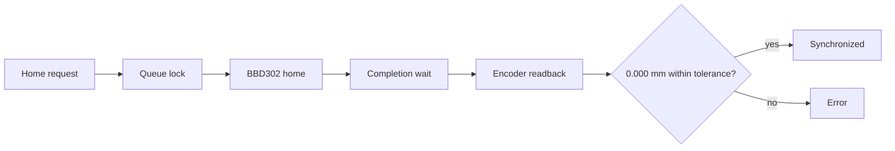

# Debug Guide

## Stage Home Does Not Reach 0.000 mm

1. Confirm `MOCK_MODE = False` only when real BBD302 hardware is connected.
2. Confirm no other backend owns `logs/hardware_owner.lock`.
3. Open `/api/stage/status` and inspect:
   - `stage.position_mm`
   - `stage.homing`
   - `stage.synchronized`
   - `stage.drift_mm`
   - `stage.stale`
4. Check `logs/hardware_log.jsonl` for `STAGE_HOME_FAILED`.
5. Do not use zero calibration to replace real homing.

## UI Position Does Not Match Hardware

The UI should mirror backend telemetry only. If it does not:

1. Check websocket connection status.
2. Compare `/api/stage/status` with the Stage panel.
3. Inspect `stage_position_sequence` to confirm updates are advancing.
4. Check `stage_position_stale`.

## Movement Is Rejected

Common safe rejections:

- scan is running or paused
- homing is active
- another stage move is in progress
- target is outside `0-300 mm`
- hardware is in fallback while real homing is requested

## Trigger Debugging

1. Open the Triggers page.
2. Create a rule with a simple intensity condition.
3. Use “Send Test Event”.
4. Inspect:
   - `GET /api/triggers/status`
   - `GET /api/triggers/logs`
   - `logs/trigger_events.jsonl`

## Storage Or Log Growth

Run the storage audit before deleting anything:

```powershell
.\.venv\Scripts\python.exe .\scripts\storage_audit.py
```

Check for:

- scan sessions with both `cube/data_cube.npy` and `cube/data_cube.npz`
- unexpectedly large `logs/hardware_log.jsonl`
- generated files listed under tracked generated-file warnings
- large `dist/`, `build/`, `cache/`, `.cache/`, `venv/`, or `.venv/` folders

Generated logs rotate by size according to
`config.STORAGE_POLICY["max_log_mb"]`. New scans use compressed `.npz` cubes by
default; enable duplicate `.npy` only when memory-mapped analysis is required.

Preview generated cleanup:

```powershell
.\.venv\Scripts\python.exe .\scripts\cleanup_generated_data.py
```

Do not use cleanup flags that include scans unless the scan data has been
backed up or is intentionally disposable.

## Homing Workflow Diagram


