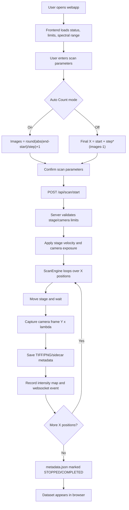

# HSI-Core Webapp Flow

## Hyperspectral Cube Concept

This app is built for a pushbroom-style hyperspectral acquisition flow:

- The camera frame represents one spatial line and wavelength information: `Y x lambda`.
- The motorized stage moves the sample/camera in `X`.
- Every X position adds one camera frame to the stack.
- The completed hyperspectral cube is therefore `X x Y x lambda`.

Useful views in the webapp:

- `X-Y @ Lambda`: spatial image at one selected wavelength.
- `X-Lambda @ Y`: spectral scan history along X for one selected Y line.
- `Y-Lambda @ X`: one camera frame/spectral slice at one selected X position.

References used for this model:

- [Vision Systems Design](https://www.vision-systems.com/factory/article/55266728/the-fundamentals-of-line-scan-imaging-part-1-what-it-is-and-when-to-use-it) explains that pushbroom acquisition scans a line and produces a data cube with X/Y spatial dimensions and Z as spectral wavelength.
- [HySpex](https://old.hyspex.com/hyperspectral-imaging/what-is-hsi/) describes line-by-line camera acquisition where one detector dimension is spatial and the other is spectral; adjacent lines form the cube.
- [Basler Exposure Time documentation](https://docs.baslerweb.com/exposure-time) states exposure limits vary by camera model, so the app reads `ExposureTime` min/max from pypylon when the camera is available.
- [Thorlabs BBD302 documentation](https://www.thorlabs.com/newgrouppage9.cfm?objectgroup_id=5066&partnumber=BBD302) describes Kinesis-supported brushless DC controllers for high-speed/high-precision motion control; the app applies a bounded velocity profile before scan.
- [pyLabLib Kinesis documentation](https://pylablib.readthedocs.io/en/latest/_modules/pylablib/devices/Thorlabs/kinesis.html) exposes velocity parameters `(min_velocity, acceleration, max_velocity)`, which matches the app's stage velocity API.

## User Flow

1. Start the app with `START_HSI_CORE.bat`.
2. Press `Detect` if the camera or stage status is not connected.
3. Confirm the hardware limits shown in the Hardware and Camera panels.
4. Set scan inputs:
   - `Auto Count On`: enter start, final, and step; image count is calculated.
   - `Auto Count Off`: enter start, step, and image count; final X is calculated.
5. Set velocity, acceleration, exposure, gain, and wavelength range.
6. Press `Start`.
7. The app asks for confirmation with the exact scan parameters before acquisition begins.
8. During scan, frames are saved with metadata and the cube view updates.
9. Press `Home` to stop active scanning and return the X stage to zero without stopping the camera stream.

## Code Flow

## Main Files

- `server_enhanced.py`: FastAPI routes, scan start/stop, hardware limits, camera settings, stage home/velocity.
- `acquisition/hal.py`: real/mock camera and stage control, Basler pypylon limits, Thorlabs velocity profile, fallback recovery.
- `acquisition/scan.py`: scan parameter validation, X-position generation, frame capture, metadata writing.
- `static/index.html`: webapp structure and controls.
- `static/app.js`: UI behavior, scan confirmation, cube view modes, hardware limit sync.
- `static/style.css`: clean multi-panel instrument UI.
- `logs/error_knowledge_base.md`: auto-updated error history with likely actions.

## Error Handling

Every camera, stage, scan, upload, UI, or system error is written to:

- `logs/system.log`
- `logs/hardware_log.jsonl`
- `logs/error_knowledge_base.md`

The markdown knowledge-base is meant to stay human-readable. It records the module, severity, error type/code, message, and a suggested likely action so repeated failures are easier to diagnose.

## Hardware Limit Rules

- Stage X travel is constrained by `config.STAGE_X_MIN_MM` and `config.STAGE_X_MAX_MM`.
- Stage velocity is constrained by `STAGE_MIN_VELOCITY_MM_S` and `STAGE_MAX_VELOCITY_MM_S`.
- Stage acceleration is constrained by `STAGE_MIN_ACCELERATION_MM_S2` and `STAGE_MAX_ACCELERATION_MM_S2`.
- Basler exposure and gain limits are read from the camera through pypylon when connected.
- If no physical camera is available, the app uses conservative config fallback limits and marks the source as fallback.
